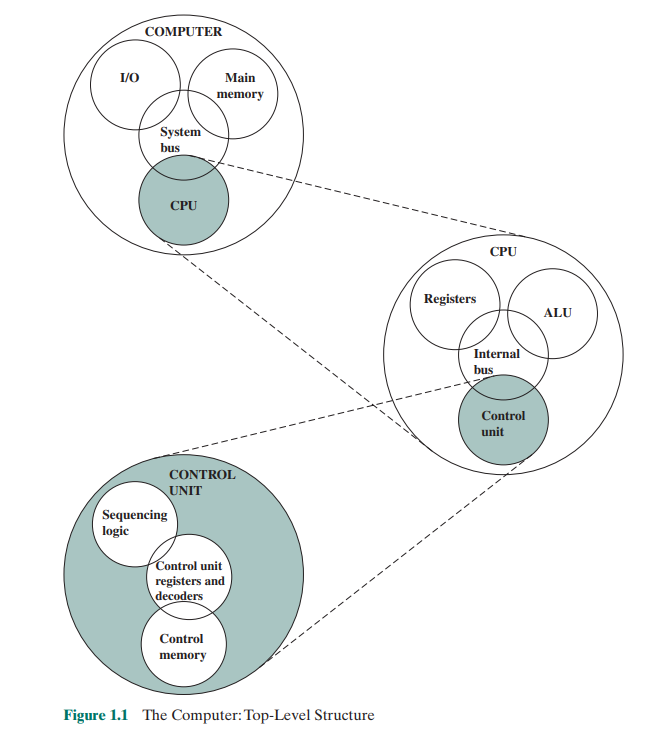
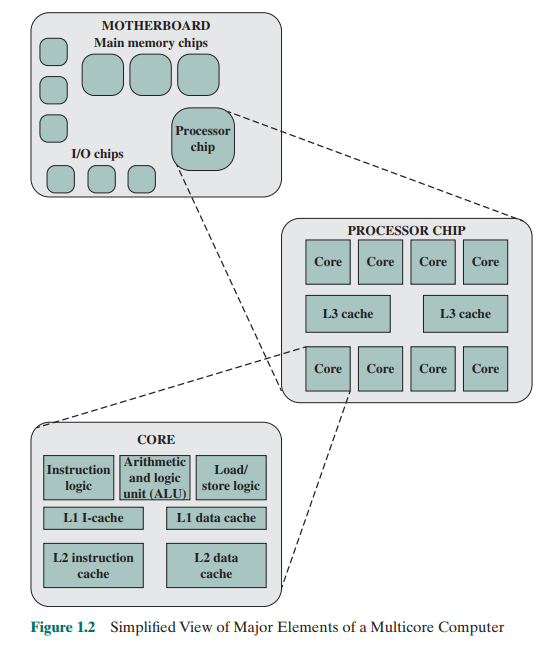
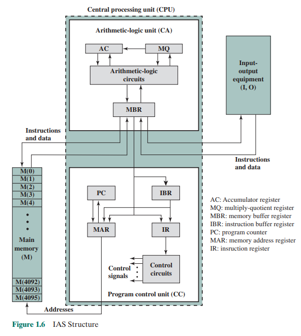
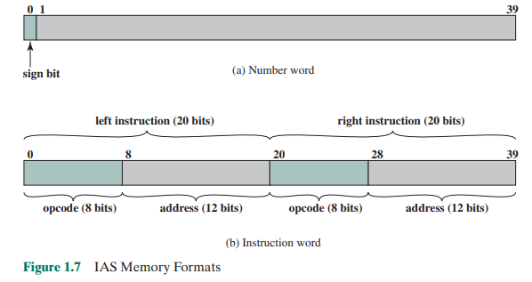
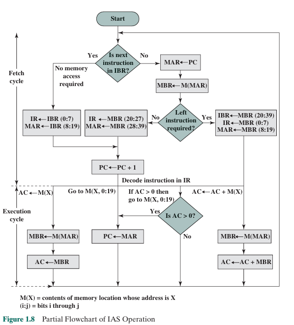
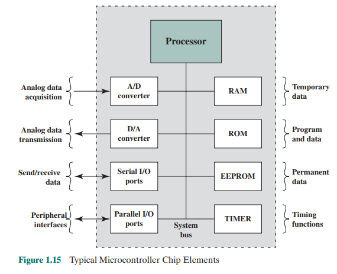
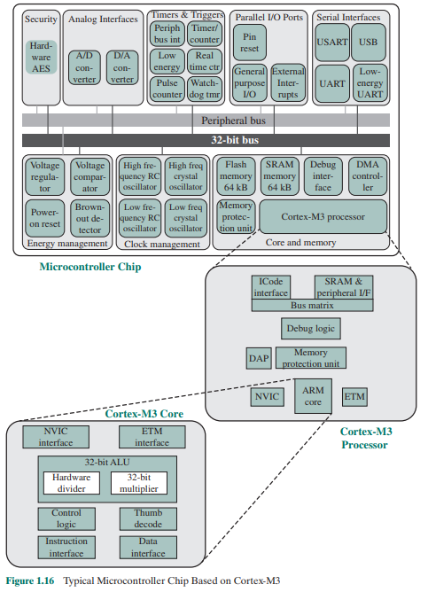

# Capítulo 1 – Basic Concepts and Computer Evolution (Resumo completo e expandido)

## 1.1 🧠 Organization and Architecture

### Arquitetura de Computadores
- Diz respeito aos atributos **visíveis ao programador**.
- Define como o sistema se comporta do ponto de vista lógico:
  - Conjunto de instruções (ISA)
  - Modos de endereçamento
  - Tamanhos de dados e registradores

### Organização de Computadores
- Trata da **implementação interna real** da arquitetura.
- Responsável por como os recursos arquiteturais são efetivamente realizados:
  - Circuitos lógicos
  - Interconexões físicas
  - Técnicas de controle e temporização

> 📌 *Exemplo*: A existência de uma instrução `MUL` (multiplicação) é uma decisão **arquitetural**. A escolha de usar um circuito dedicado ou uma sequência de somas para implementá-la é uma decisão **organizacional**.

### Importância prática
- Permite que diferentes modelos de hardware sejam compatíveis com o mesmo software.
- Exemplo real: diversos modelos do **IBM System/370** compartilham arquitetura, mas variam em organização.

---

## 1.2 🏗️ Structure and Function

### As quatro funções fundamentais de um computador

| Função | Descrição |
|--------|-----------|
| 🧮 Processamento de Dados | Cálculos e operações lógicas |
| 💾 Armazenamento de Dados | Retenção temporária (RAM) ou permanente (discos) |
| 🔄 Movimentação de Dados | Transferência entre componentes internos ou externos |
| 🧭 Controle | Coordenação das operações por meio de sinais |

### Componentes estruturais (Figura 1.1)

| Componente | Subcomponentes / Função |
|------------|--------------------------|
| 🧠 CPU (Processador) | ALU, unidade de controle, registradores internos |
| 🧠 ALU | Executa operações aritméticas e lógicas |
| 🧠 Registradores | Armazenam temporariamente dados e instruções em processamento |
| 📦 Memória Principal | Armazena instruções e dados ativos |
| 🔌 I/O (Entrada/Saída) | Comunicação com o ambiente externo |
| 🔁 Interconexão (barramentos) | Transporte de dados, endereços e sinais de controle |

### Hierarquia de níveis
- O sistema é descrito **do topo para baixo**.
- Exemplo:
  - Sistema computacional → subsistemas → unidades funcionais → circuitos → lógica → transistores.
 

 
 ---
 
### Estrutura de um Chip Multicore  

A Figura 1.2 mostra a organização interna de um **processador multicore moderno**, ou seja, um único chip contendo **múltiplos núcleos de CPU**, cada um capaz de executar instruções de forma independente e paralela.

Esse design é fundamental na computação atual, especialmente para aplicações multitarefa, processamento paralelo e sistemas embarcados de alto desempenho.

### Componentes do chip multicore

| Componente | Função |
|------------|--------|
| **Cores de CPU** | Núcleos independentes com ALU, unidade de controle, registradores e cache L1 própria. Executam instruções simultaneamente. |
| **Cache L1 (nível 1)** | Cache privada de cada núcleo, dividida em instruções e dados. Tem acesso extremamente rápido. |
| **Cache L2 (nível 2)** | Cache intermediária, geralmente dedicada a cada núcleo ou compartilhada entre poucos núcleos. Armazena dados acessados com frequência. |
| **Cache L3 (nível 3)** | Cache grande e **compartilhada entre todos os núcleos**. Atua como buffer antes da memória principal. |
| **Interconexão interna** | Conjunto de barramentos ou rede interna que conecta os núcleos, caches e controladores de memória. |
| **Controlador de Memória** | Gerencia as requisições dos núcleos à memória principal (RAM). Pode ser integrado ao chip para maior eficiência. |

---

### Vantagens do modelo multicore

- ✅ **Paralelismo real**: múltiplos núcleos executam tarefas simultaneamente.
- ✅ **Eficiência energética**: mais desempenho com menor aumento de consumo e calor.
- ✅ **Escalabilidade**: mais núcleos = maior capacidade de processamento para cargas intensivas.
- ✅ **Comunicação interna rápida**: as caches e interconexões internas evitam gargalos com a RAM.

Essa estrutura representa a principal evolução da organização de processadores desde os anos 2000, substituindo o foco no aumento de frequência pelo aumento no número de núcleos.

---

## 1.3 🕰️ A Brief History of Computers

### Gerações de computadores

| Geração | Tecnologia | Exemplo clássico |
|---------|------------|------------------|
| 1ª (1946–57) | Válvulas | ENIAC, IAS |
| 2ª (1958–64) | Transistores | IBM 7094 |
| 3ª (1965–71) | Circuitos Integrados (SSI/MSI) | IBM System/360 |
| 4ª (1972–77) | LSI | PDP-11 |
| 5ª (1978–91) | VLSI | Intel 8086, PCs |
| 6ª (1991–presente) | ULSI, multicore, nuvem | ARM, x86 modernos |

---

## 🏛️ A Máquina IAS (Institute for Advanced Study Computer)

### Contexto histórico
- Concebida por John von Neumann e equipe entre 1946 e 1952.
- Foi a **primeira máquina com arquitetura de programa armazenado**.
- Tornou-se o modelo base de todos os computadores de arquitetura clássica (“arquitetura de von Neumann”).

### Componentes funcionais (Figura 1.6)

| Unidade | Descrição |
|--------|-----------|
| AC (Accumulator) | Armazena o resultado das operações da ALU |
| MQ (Multiplier-Quotient Register) | Guarda a parte inferior do produto ou o quociente da divisão |
| MBR (Memory Buffer Register) | Armazena temporariamente os dados que entram ou saem da memória |
| MAR (Memory Address Register) | Endereço de memória a ser acessado |
| PC (Program Counter) | Mantém o endereço da próxima instrução a ser executada |
| IR (Instruction Register) | Código da instrução atual em execução |
| IBR (Instruction Buffer Register) | Guarda a segunda instrução de uma palavra de memória |

---
### Formato da memória (Figura 1.7)

- Cada palavra da memória tem **40 bits**.
- Pode conter:
  - Um número binário de 40 bits (com sinal)
  - Ou duas instruções de 20 bits (8 bits de opcode + 12 bits de endereço)

---
### Fluxo de Execução da Máquina IAS  

A Figura 1.8 representa o **fluxograma parcial do ciclo de operação da máquina IAS**, abordando as fases de **busca (fetch)**, **decodificação** e **execução** das instruções.

Essa representação gráfica é essencial para compreender como os componentes da arquitetura IAS — como registradores, memória e unidade de controle — interagem para processar instruções armazenadas na memória principal.

### 📋 Registradores da Máquina IAS (com base na Figura 1.8)

A seguir, apresentamos os principais registradores utilizados no ciclo de busca e execução da máquina IAS, com base na Figura 1.8. Cada um tem papel específico na manipulação e controle de dados e instruções.

| Registrador | Nome Completo                  | Função no Ciclo de Instrução |
|-------------|--------------------------------|-------------------------------|
| **PC**      | Program Counter                | Armazena o endereço da próxima palavra de memória a ser buscada. Após buscar uma palavra, é incrementado (`PC ← PC + 1`). |
| **MAR**     | Memory Address Register        | Recebe o endereço a ser acessado (leitura ou escrita). Intermedia a comunicação com a memória. |
| **MBR**     | Memory Buffer Register         | Armazena o conteúdo lido da memória (ou a ser escrito nela). Pode conter dados ou palavras de instrução completas. |
| **IR**      | Instruction Register           | Armazena o código da instrução (opcode) que está sendo decodificada e executada. |
| **IBR**     | Instruction Buffer Register    | Armazena temporariamente a **segunda instrução** de uma palavra de 40 bits, quando a primeira já foi processada. |
| **AC**      | Accumulator                    | Armazena os resultados intermediários das operações aritméticas ou lógicas. |
| **MQ**      | Multiplier-Quotient Register   | Usado em operações de multiplicação e divisão. Armazena uma parte do resultado. |

> 💡 Esses registradores compõem o "coração" do fluxo de controle da máquina IAS, e sua movimentação determina o caminho entre a memória, a decodificação e a execução da instrução.

---
### 🧭 Etapas do Fluxo de Execução

#### 1. Início e Busca da Instrução

O processo se inicia com a verificação:  
**“Há uma instrução restante no IBR?”** (Instruction Buffer Register)

- ✅ **Sim**: o conteúdo do IBR é transferido diretamente para o **Instruction Register (IR)** e o **Memory Address Register (MAR)**.  
  Nenhum acesso adicional à memória é necessário.
- ❌ **Não**: a próxima palavra de instrução completa é buscada da memória:
  - `MAR ← PC` (o Program Counter indica a palavra a ser lida)
  - `MBR ← M(MAR)` (a palavra é lida da memória e armazenada no Memory Buffer Register)

#### 2. Decisão: Qual metade da palavra usar?

Cada palavra de 40 bits pode conter até **duas instruções de 20 bits**: esquerda e direita.

- A unidade de controle verifica se é necessário executar a instrução da esquerda (bit alto).
- Se sim, ela é extraída dos bits 0:19 e movida para:
  - `IR ← MBR(0:7)` (opcode)
  - `MAR ← MBR(8:19)` (endereço)
- Caso contrário, a instrução da direita é processada:
  - `IR ← MBR(20:27)`
  - `MAR ← MBR(28:39)`

Após isso, o **PC é incrementado**: `PC ← PC + 1`

---

### ⚙️ Decodificação e Execução da Instrução

- A instrução carregada no `IR` é decodificada e o controle passa para o **ciclo de execução**.
- Exemplos de execução com base na instrução:

| Tipo de Instrução | Ação Realizada |
|-------------------|----------------|
| `LOAD M(X)` | `AC ← M(X)` (carrega o conteúdo da memória para o acumulador) |
| `ADD M(X)` | `AC ← AC + M(X)` |
| `SUB M(X)` | `AC ← AC - M(X)` |
| `JUMP M(X)` | `PC ← X` (salta para novo endereço) |
| `JUMP+ M(X)` | Se `AC > 0` então `PC ← X` |
| `STOR M(X)` | `M(X) ← AC` (salva o acumulador na memória) |

Durante a execução:
- Se for necessário acessar a memória:
  - `MBR ← M(MAR)`
  - O dado lido é movido para o AC: `AC ← MBR`
- Ou no caso de escrita:
  - `MBR ← AC`
  - `M(MAR) ← MBR`

---

### 🌀 Ciclo de Controle

Esse processo de busca → decodificação → execução se repete ciclicamente, conforme o conteúdo do **Program Counter (PC)**. A máquina só altera seu fluxo quando encontra uma instrução de desvio (`JUMP`) ou uma instrução condicional (`JUMP+`).

Esse fluxo de controle é central no projeto de todas as arquiteturas baseadas no modelo de Von Neumann.

---

### 📌 Observações Importantes

- O **IBR** permite a execução de duas instruções consecutivas sem novo acesso à memória, aumentando a eficiência.
- A estrutura sequencial é típica de CPUs sem pipeline.
- O uso explícito de registradores intermediários (MBR, MAR, IR, etc.) demonstra como o controle da IAS é **totalmente microprogramado**.

---

## 1.5 🔌 Embedded Systems

### Definição

Sistemas embarcados (*embedded systems*) são sistemas computacionais dedicados a executar **uma função específica** como parte de um produto maior. Ao contrário de computadores de uso geral, que executam diversos programas, os sistemas embarcados são construídos para realizar **tarefas específicas com alta eficiência, baixo consumo e confiabilidade**.

Estes sistemas estão presentes em áreas como automação residencial, veículos, dispositivos médicos, equipamentos industriais e dispositivos portáteis, sendo atualmente a forma mais difundida de computador no mundo.

---

### Características Fundamentais

| Característica | Descrição |
|----------------|-----------|
| ⚡ Baixo consumo de energia | Projetados para operar com alimentação limitada (baterias, painéis solares) |
| 🧠 Função fixa | Dedicados a uma aplicação ou conjunto muito restrito de tarefas |
| 💾 Firmware | Código embarcado armazenado em ROM/Flash, raramente modificado |
| 🔄 Controle em tempo real | Muitas aplicações exigem resposta rápida a eventos físicos |
| 📦 Alta integração | Um único chip pode conter CPU, memória e periféricos |
| 🧩 Interface com o ambiente físico | Controlam motores, sensores, LEDs, atuadores, entre outros |

---

### Organização de um Sistema Embarcado  

A Figura 1.14 ilustra uma **estrutura típica e genérica** de um sistema embarcado, destacando os principais blocos funcionais que se conectam ao processador. A seguir, explicamos o papel de cada componente:

| Componente             | Descrição |
|------------------------|-----------|
| **Processor**          | É o núcleo computacional do sistema embarcado. Executa o firmware responsável por processar dados, tomar decisões e controlar os periféricos. É conectado a todos os demais blocos e gerencia a operação geral do sistema. |
| **Memory**             | Armazena tanto o código do programa quanto os dados utilizados pelo processador. Pode incluir tipos como ROM (para firmware) e RAM (para dados temporários). |
| **Custom Logic**       | Lógica personalizada implementada em hardware (como circuitos digitais específicos ou FPGAs) para executar funções que não são facilmente tratadas por software — por exemplo, controle de sinais em tempo real, modulação, protocolos proprietários. |
| **Diagnostic Port**    | Interface usada para depuração, atualização de firmware, monitoramento de funcionamento ou coleta de logs. Permite o acesso técnico ao sistema embarcado sem interferir no usuário final. |
| **D/A Conversion**     | Conversor Digital-Analógico. Permite que o processador envie sinais contínuos (analógicos) para o mundo físico — por exemplo, controlar um motor, emitir som ou variar brilho de LEDs. |
| **Actuators/Indicators** | Dispositivos que **reagem fisicamente** aos comandos do sistema, como motores, relés, LEDs ou displays. São os "efetores" do sistema embarcado. |
| **A/D Conversion**     | Conversor Analógico-Digital. Permite que o sistema leia sinais do mundo real, como temperatura, luz ou tensão elétrica, convertendo-os em valores digitais que podem ser processados pelo software. |
| **Sensors**            | Dispositivos físicos que coletam dados do ambiente, como sensores de temperatura, umidade, pressão, movimento etc. Seus sinais normalmente precisam passar por um conversor A/D antes de serem usados pelo processador. |
| **Human Interface**    | Interface com o usuário, que pode incluir botões, teclados, telas sensíveis ao toque, indicadores visuais ou sonoros. Nem todos os sistemas embarcados possuem interface humana — muitos operam de forma totalmente autônoma. |

Essa organização mostra como o processador atua como centro de controle em sistemas embarcados, interagindo com componentes físicos do ambiente por meio de sensores e atuadores, enquanto lida com lógica interna, memória e interfaces de depuração ou usuário.

---

### Elementos de um Chip de Microcontrolador  

A Figura 1.15 apresenta uma visão funcional típica de um **chip de microcontrolador**, que é uma forma altamente integrada de computador em miniatura, ideal para aplicações embarcadas. O diagrama mostra os principais blocos internos conectados por um **barramento de sistema (System Bus)**.

| Componente            | Função Principal |
|-----------------------|------------------|
| **Processor**         | Unidade central de processamento. Executa as instruções armazenadas na memória e coordena todas as operações internas do microcontrolador. |
| **A/D Converter**     | *Analog-to-Digital Converter*. Converte sinais analógicos recebidos de sensores em valores digitais utilizáveis pelo processador. |
| **D/A Converter**     | *Digital-to-Analog Converter*. Transforma dados digitais gerados pelo processador em sinais analógicos, que podem ser enviados a atuadores. |
| **Serial I/O Ports**  | Portas seriais para comunicação com dispositivos externos. Suportam protocolos como UART, SPI e I²C, ideais para comunicação com sensores e módulos. |
| **Parallel I/O Ports**| Portas de entrada/saída com múltiplos pinos manipuláveis simultaneamente, usadas para controle direto de dispositivos como LEDs, botões, displays, relés. |
| **RAM**               | Memória volátil usada para armazenar dados temporários durante a execução do programa. É apagada quando o microcontrolador é desligado. |
| **ROM**               | Memória somente leitura usada para armazenar o firmware — o programa principal executado pelo microcontrolador. |
| **EEPROM**            | Memória permanente regravável, usada para armazenar configurações e dados que devem persistir mesmo sem energia (ex: calibração, IDs, preferências). |
| **TIMER**             | Módulo de temporização usado para gerar atrasos precisos, contagens de eventos, geração de PWM ou ativação de interrupções periódicas. |
| **System Bus**        | Canal de comunicação interno que interliga todos os componentes do chip — permite transferência de dados, endereços e sinais de controle entre as unidades. |

---
### Categorias Funcionais (conforme indicado na figura)

- **Analog data acquisition**: refere-se ao uso do **A/D converter** para obter dados do mundo físico (ex: temperatura, luz, som).
- **Analog data transmission**: realizada pelo **D/A converter**, que envia sinais contínuos para dispositivos como alto-falantes ou motores.
- **Send/receive data**: uso das **portas seriais** para comunicação digital com periféricos e outros chips.
- **Peripheral interfaces**: conexão com o ambiente externo via **portas paralelas**, controlando entradas e saídas digitais.
- **Temporary data**: manipulado pela **RAM** durante a execução.
- **Program and data**: armazenados permanentemente na **ROM**.
- **Permanent data**: configurável e regravável, reside na **EEPROM**.
- **Timing functions**: funções de contagem e temporização, gerenciadas pelo **TIMER**.

Essa organização mostra como o microcontrolador é capaz de realizar operações completas — da aquisição de dados ao controle físico — **sem a necessidade de componentes externos adicionais**, o que o torna ideal para sistemas embarcados compactos e eficientes.

---

### Aplicações Comuns

| Setor | Exemplos |
|-------|----------|
| 🚗 Automotivo | Freios ABS, airbag, sensores de estacionamento, ignição |
| 🏠 Doméstico | Termostatos, micro-ondas, máquinas de lavar, aspiradores inteligentes |
| 🏥 Médico | Monitores cardíacos, marcapassos, equipamentos de dosagem |
| 🏭 Industrial | Controladores lógicos programáveis (CLPs), sensores de presença |
| 🌐 IoT | Câmeras, smart locks, sensores climáticos, hubs conectados |

---

### Desenvolvimento de Software

- Linguagens: C (predominante), C++, Assembly (casos críticos de desempenho).
- IDEs específicas de fabricantes: STM32CubeIDE, MPLAB X, Keil µVision.
- Ferramentas de depuração: JTAG, SWD, simuladores.
- Em sistemas com multitarefa, usa-se um **RTOS** (Real-Time Operating System), como FreeRTOS, para gerenciar tarefas, temporizadores e interrupções.

---

### Relevância para Arquitetura de Computadores

O estudo de sistemas embarcados revela:

- Como a arquitetura (ISA) e a organização (internals, periféricos, barramentos) são ajustadas para tarefas especializadas.
- A importância da **integração entre software e hardware**, já que o programador lida diretamente com registradores, endereços de memória e interrupções.
- A aplicação real das decisões de projeto que envolvem consumo, desempenho e responsividade.
- O uso prático da **arquitetura ARM**, que combina simplicidade, escalabilidade e suporte a aplicações industriais e comerciais.

---

## 1.6 🧬 ARM Architecture

### Histórico
- Criada nos anos 80 pela Acorn (Reino Unido).
- Evoluiu como uma arquitetura **RISC** (Reduced Instruction Set Computer).
- Atualmente licenciada pela ARM Holdings.

### Vantagens

- Pouco consumo de energia.
- Menor quantidade de transistores → menor calor.
- Alta eficiência para dispositivos móveis.

### Famílias ARM

| Série | Aplicações |
|-------|------------|
| Cortex-A | Smartphones, tablets, TVs inteligentes (usa MMU) |
| Cortex-R | Sistemas com tempo real rigoroso (ex: freios ABS, industrial) |
| Cortex-M | Microcontroladores simples e de baixo consumo (IoT, wearables) |

### Arquitetura de um Microcontrolador Cortex-M3  

A Figura 1.16 mostra a organização funcional de um **microcontrolador baseado na arquitetura ARM Cortex-M3**, dividido em três níveis principais:

1. **Chip completo do microcontrolador**
2. **Processador Cortex-M3**
3. **Núcleo Cortex-M3 (Core)**

---

### 🧠 Principais Componentes – Nível do Chip

| Componente | Função |
|------------|--------|
| **Cortex-M3 Processor** | Cérebro do sistema: executa o código, controla periféricos, toma decisões. |
| **Flash Memory** | Armazena permanentemente o firmware do sistema. |
| **SRAM** | Memória volátil para dados temporários durante a execução. |
| **DMA Controller** | Controlador de acesso direto à memória. Permite transferências sem uso do processador, melhorando o desempenho. |
| **Debug Interface** | Permite depuração e programação do microcontrolador via JTAG/SWD. |
| **Memory Protection Unit (MPU)** | Isola regiões de memória, útil em sistemas com multitarefa ou para evitar corrupção de dados. |

---

### 🧩 Interfaces de Entrada/Saída e Temporização

| Componente | Função |
|------------|--------|
| **GPIO / Parallel I/O Ports** | Pinos programáveis para interação com LEDs, sensores, relés, botões etc. |
| **Serial Interfaces (USART, UART, USB)** | Comunicação digital com módulos externos (como Wi-Fi, GPS, Bluetooth). |
| **Timers e Watchdog** | Temporizadores e contadores, essenciais para tarefas periódicas e segurança (reset automático em caso de falha). |
| **A/D e D/A Converters** | Convertem sinais analógicos de sensores e para atuadores (ex: controle de motor). |

---

### ⚙️ Núcleo Cortex-M3 (Core)

Dentro do processador, o núcleo **ARM Cortex-M3** traz elementos de hardware otimizados para eficiência:

| Componente | Função |
|------------|--------|
| **ARM Core (32 bits)** | Executa instruções da arquitetura Thumb/Thumb-2. |
| **Thumb Decode** | Decodificador de instruções compactas, aumentando a eficiência da memória. |
| **NVIC (Nested Vectored Interrupt Controller)** | Controla interrupções com prioridade configurável. Permite resposta rápida a eventos. |
| **ALU + Multiplicador/Divisor** | Executa operações matemáticas. O hardware de multiplicação/divisão aumenta a velocidade de execução. |
| **Instruction/Data Interfaces** | Barramentos dedicados para busca de instruções e dados — ajudam a evitar gargalos. |
| **ETM (Embedded Trace Macrocell)** | Permite rastrear e registrar a execução do código (útil para depuração em tempo real). |

---

### 🔌 Barramentos e Comunicação Interna

- **32-bit bus**: Interliga os blocos de processamento e memória com alta largura de banda.
- **Peripheral bus**: Conecta os periféricos internos à CPU com velocidade adequada para comunicação e controle.
- **Bus Matrix**: Gerencia o roteamento de dados entre os diferentes blocos internos.
  

### 💡 Conclusão

A organização do microcontrolador Cortex-M3 combina **eficiência, integração e suporte a tempo real**, características essenciais para sistemas embarcados. Com recursos como gerenciamento de interrupções (NVIC), proteção de memória (MPU) e barramentos dedicados, essa arquitetura se torna ideal para aplicações críticas em áreas como automação, IoT e dispositivos portáteis.

---

## 🧾 Resumo Final do Capítulo 1

O Capítulo 1 introduz os **fundamentos da organização e arquitetura de computadores**, distinguindo claramente entre **arquitetura** (o que é visível ao programador) e **organização** (como o hardware implementa isso). São apresentadas as **quatro funções principais de um sistema computacional**: processamento, armazenamento, movimentação e controle de dados.

A estrutura básica de um computador moderno é descrita em camadas hierárquicas, passando por **CPU, memória, I/O e interconexões**, culminando na arquitetura **multicore**, onde vários núcleos operam de forma paralela, como mostrado na Figura 1.2.

Na sequência, o capítulo explora a evolução dos computadores por gerações, com destaque para a **máquina IAS** – modelo pioneiro de arquitetura com programa armazenado. Através do estudo detalhado de seus registradores e ciclo de instrução (Figura 1.8), compreendemos os mecanismos básicos que inspiraram as arquiteturas modernas.

Em seguida, são abordados os **sistemas embarcados**, que exemplificam o uso prático da arquitetura ajustada a tarefas específicas, com alta integração e controle direto de hardware. Esse conceito é aprofundado com base nos exemplos do ARM Cortex-M3 (Figuras 1.14 e 1.15), culminando na descrição da **arquitetura ARM genérica** (Figura 1.16), amplamente usada em dispositivos embarcados e IoT.

Com isso, o capítulo estabelece a base teórica e prática para entender como instruções em linguagens de alto nível, como C, se traduzem em ações no nível de hardware, preparando o terreno para os capítulos seguintes sobre desempenho, estrutura da CPU e tipos de instrução.
