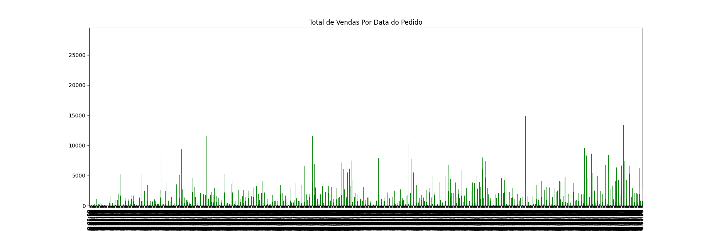
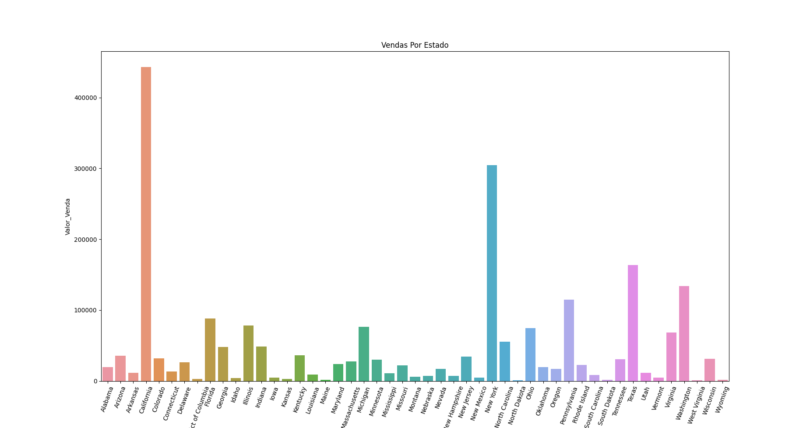
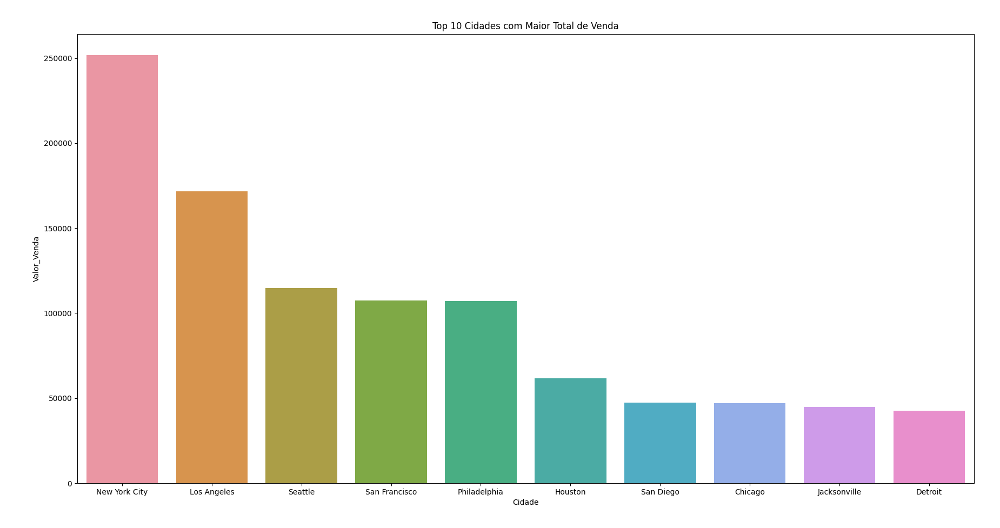
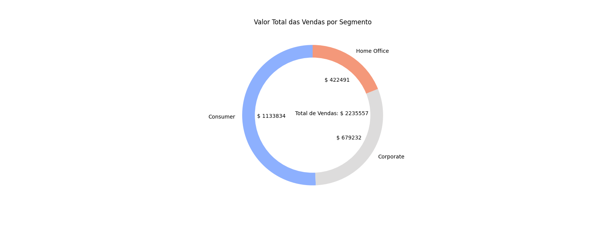
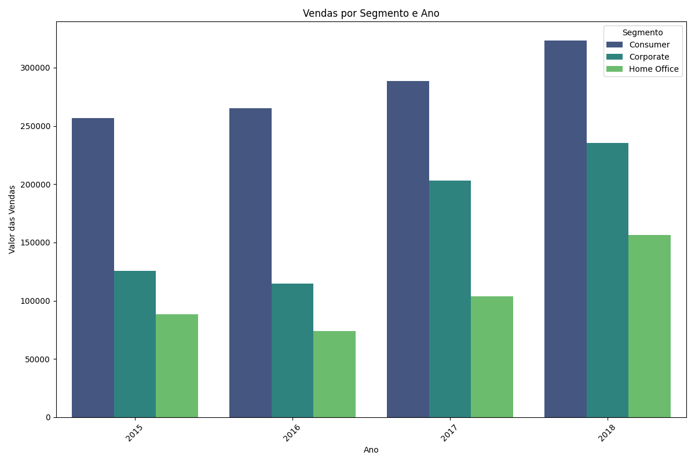

# Respostas da Análise Exploratória de Dados

## Pergunta 1: Qual Cidade com Maior Valor de Venda de Produtos da Categoria 'Office Supplies'?
**Resposta**: 
A cidade com maior valor de vendas para categoria 'Office Supplies' foi New York City

## Pergunta 2: Qual o Total de Vendas Por Data do Pedido?
**Resposta**:

## Pergunta 3: Qual o Total de Vendas por Estado?
**Resposta**:

## Pergunta 4: Quais São as 10 Cidades com Maior Total de Vendas?
**Resposta**:

## Pergunta 5: Qual Segmento Teve o Maior Total de Vendas?
**Resposta**:

## Pergunta 6: Qual o Total de Vendas Por Segmento e Por Ano?
**Resposta**:
| Segmento     | Ano  | Valor_Venda  |
|--------------|------|--------------|
| Consumer     | 2015 | 256719.92    |
| Consumer     | 2016 | 265295.26    |
| Consumer     | 2017 | 288459.56    |
| Consumer     | 2018 | 323359.60    |
| Corporate    | 2015 | 125819.60    |
| Corporate    | 2016 | 114643.12    |
| Corporate    | 2017 | 203266.74    |
| Corporate    | 2018 | 235502.73    |
| Home Office  | 2015 | 88229.09     |
| Home Office  | 2016 | 74134.13     |
| Home Office  | 2017 | 103639.63    |
| Home Office  | 2018 | 156488.58    |

## Pergunta 7: Quantas Vendas Receberiam 15% de Desconto?
**Resposta**:

