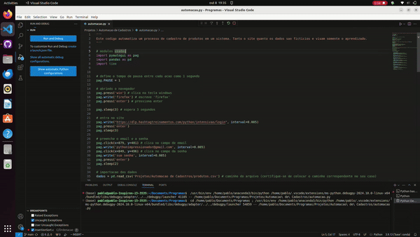

# 🛠️ Automação de Cadastro de Produtos

Este projeto implementa um processo automatizado de cadastro de produtos em um sistema fictício utilizando a biblioteca `pyautogui` para simular ações no navegador e preencher formulários com dados provenientes de um arquivo CSV.

## 📽️ Demonstração

Veja abaixo uma demonstração do código em funcionamento:



## 📚 Funcionalidades

- **Abertura Automática do Navegador**: O script abre automaticamente o navegador e acessa o site fictício de cadastro de produtos.
- **Preenchimento de Formulários**: Os dados dos produtos, como código, marca, tipo, categoria, preço, custo, e observações, são preenchidos automaticamente no formulário do site.
- **Leitura de Arquivo CSV**: O script lê um arquivo CSV com os dados dos produtos que devem ser cadastrados.
- **Automação com PyAutoGUI**: A navegação no site e o preenchimento dos campos são feitos através de comandos simulados de teclado e mouse.

## 🚀 Como Utilizar

Para utilizar este programa, siga os passos abaixo:

1. **Instale as Dependências**  
   Certifique-se de ter o Python 3.x e as bibliotecas `pyautogui` e `pandas` instaladas. Caso não tenha, você pode instalá-las com os seguintes comandos:
   ```bash
   pip install pyautogui pandas
   ```
2. **Ajuste as Coordenadas**  
  O script utiliza coordenadas específicas para clicar em campos do formulário. Você pode precisar ajustar as coordenadas `x` e `y` dos cliques de acordo com a resolução e a disposição da sua tela.

3. **Prepare o Arquivo CSV**  
 O arquivo CSV contendo os dados dos produtos já foi fornecido. Certifique-se de ajustar o caminho no código para o local onde o arquivo está armazenado no seu sistema.

 4. **Execute o Script**  
    ```bash
    python automacao_cadastro.py
    ```
5. **Acompanhe o processo**  
  O script abrirá o navegador (firefox, no caso do código), navegará até o site e preencherá automaticamente os campos do formulário com os dados do arquivo CSV. Certifique-se de que o navegador esteja na tela e visível durante a execução do script.
 
 ## 🛠️ Estrutura da Pasta

Esta Pasta é organizado da seguinte forma:

- **`automacao.py`**: O script principal contendo a lógica de automação do cadastro de produtos.
- **`exemplo_uso.gif`**: GIF mostrando o funcionamento do código
- **`produtos.csv`**: Arquivo com os dados a serem cadastrados
- **`README.md`**: Este arquivo que você está lendo.

## 💬 Contato

Se você tiver alguma dúvida ou sugestão, sinta-se à vontade para entrar em contato!

<p align="left">
  <a href="mailto:pablocaballero07@gmail.com" title="Gmail">
    
  </a>
  <a href="https://www.linkedin.com/in/pabl0maciel" title="LinkedIn">
    
  </a>
  <a href="https://wa.me/11963934212" title="WhatsApp">
    
  </a>
  <a href="https://www.instagram.com/pabl0maciel" title="Instagram">
    
  </a>
</p>

## 🤝 Contribuições

Se você deseja contribuir com este arquivo, sinta-se à vontade para enviar pull requests! Suas contribuições são sempre bem-vindas.

## 📜 Licença

Este projeto está licenciado sob a [Licença MIT](LICENSE).

Obrigado por visitar o meu projeto e espero que o conteúdo aqui seja útil para o seu aprendizado e desenvolvimento!
