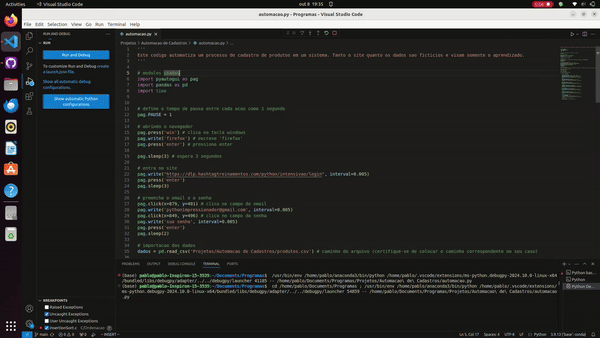

<div align="center">


</div>

<div align="center">


</div>

---

## 🎯 Objetivo

Automatizar o preenchimento de cadastros de produtos em um sistema web, eliminando inserções manuais. O script lê um arquivo CSV com os dados dos produtos e preenche o formulário campo a campo, simulando ações de teclado e mouse com PyAutoGUI.

---

## 🎬 Demonstração



---

## ⚙️ Como funciona

```
produtos.csv
     │
     ▼
pandas.read_csv()
     │
     ▼
loop por linha
     │
     ├── abre o navegador (Firefox)
     ├── acessa o sistema e faz login
     └── para cada produto:
             ├── clica no campo código    → digita → Tab
             ├── digita marca             → Tab
             ├── digita tipo              → Tab
             ├── digita categoria         → Tab
             ├── digita preço unitário    → Tab
             ├── digita custo             → Tab
             ├── digita obs (se houver)   → Tab
             ├── Enter (envia o cadastro)
             └── scroll para o topo
```

---

## 📊 Estrutura do CSV

O arquivo `produtos.csv` deve seguir o formato abaixo:

| Campo | Descrição | Exemplo |
|-------|-----------|---------|
| `codigo` | Código único do produto | `MOLO000251` |
| `marca` | Marca do produto | `Logitech` |
| `tipo` | Tipo do produto | `Mouse` |
| `categoria` | Categoria numérica | `1` |
| `preco_unitario` | Preço de venda | `25.95` |
| `custo` | Custo do produto | `6.50` |
| `obs` | Observações (opcional) | `Conferir estoque` |

> O campo `obs` é opcional — o script verifica se está vazio antes de tentar preencher.

---

## 🚀 Como executar

**1. Instale as dependências**

```bash
pip install pyautogui pandas
```

**2. Ajuste as coordenadas de clique**

As coordenadas `x` e `y` dos cliques são específicas para a resolução da sua tela. Para descobrir as coordenadas corretas, descomente o trecho no início do script:

```python
time.sleep(5)
print(pag.position())  # posicione o cursor no campo desejado
```

**3. Ajuste o caminho do CSV**

```python
# Altere para o caminho correto no seu ambiente
dados = pd.read_csv('Projetos/Automacao de Cadastros/produtos.csv')
```

**4. Execute**

```bash
python automacao.py
```

> ⚠️ Mantenha o navegador visível e em foco durante toda a execução — o PyAutoGUI controla o mouse e teclado em tempo real.

---

## 📂 Estrutura

```
📦 Automacao de Cadastros/
│
├── automacao.py       # Script principal
├── produtos.csv       # Dados dos produtos a cadastrar
├── exemplo_uso.gif    # Demonstração em vídeo
└── README.md
```

---

<div align="center">


</div>
