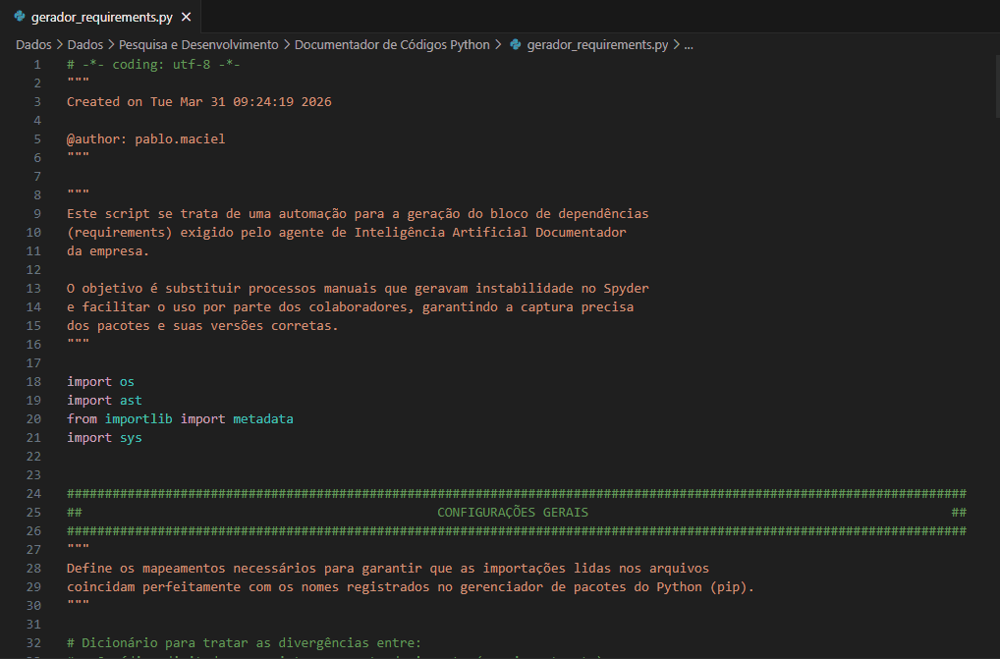

<div align="center">


</div>

<div align="center">


</div>

---

## 🎯 O que é

Agente de IA que gera automaticamente **documentação técnica completa e padronizada** de scripts Python em formato Markdown — pronto para uso em SharePoint, Git ou Notion.

A partir do código-fonte, metadados técnicos e dependências do ambiente, o agente documenta objetivo, fluxo, entradas, saídas, transformações, premissas, limitações e trechos de código relevantes — **sem inventar conteúdo** e com validação obrigatória antes de iniciar.

> Desenvolvido e adotado como **padrão de documentação interna** na Integral Trust.

---

## 🎬 Demonstração



---

## 📂 Estrutura

```
📦 Python Documentation Agent (PDA)/
│
├── Instrucoes do Agente/
│   ├── instrucoes_V1.txt        # versão inicial (depreciada)
│   └── instrucoes_V1.2.txt      # ✅ versão atual em produção
│
├── Template/
│   └── template.txt             # template de saída em Markdown
│
├── gerador_requirements.py      # script auxiliar de extração de dependências
├── manual_wiki.md               # manual de uso interno
├── exemplo_requirements.gif     # demonstração em vídeo
└── README.md
```

---

## ⚙️ Como funciona

```
┌─────────────────────────────────────────────────────────────────┐
│                          INSUMOS                                │
│                                                                 │
│  arquivo(s) .py  +  metadados técnicos  +  bloco dependências  │
└──────────────────────────────┬──────────────────────────────────┘
                               │
                               ▼
┌─────────────────────────────────────────────────────────────────┐
│                    AGENTE (LLM) — V1.2                          │
│                                                                 │
│  1. Valida insumos — aborta se qualquer campo estiver ausente   │
│  2. Classifica scripts em Principal / Auxiliar                  │
│  3. Documenta visão geral: objetivo, fluxo, entradas e saídas   │
│  4. Documenta cada script individualmente com trechos de código │
│  5. Identifica premissas operacionais e limitações              │
│  6. Gera o .md via Python (UTF-8 com BOM)                       │
│  7. Retorna status de auditoria + link de download              │
└──────────────────────────────┬──────────────────────────────────┘
                               │
                               ▼
┌─────────────────────────────────────────────────────────────────┐
│                           SAÍDA                                 │
│                                                                 │
│  documentacao.md — estrutura padronizada pronta para wiki       │
└─────────────────────────────────────────────────────────────────┘
```

---

## 📥 Insumos necessários

Todos os campos abaixo são **obrigatórios**. O agente aborta se qualquer um estiver ausente ou com placeholder:

| Campo | Descrição |
|-------|-----------|
| `Nome do Projeto` | Nome do projeto a ser documentado |
| `Descrição de Funcionamento` | Breve descrição do que o projeto faz |
| `Script Principal` | Nome do arquivo `.py` de entrada do fluxo |
| `Caminho` | Caminho de rede UNC ou URL do repositório |
| `Desenvolvido por` | Nome e equipe do responsável |
| `Ambiente e Dependências` | Bloco gerado pelo `gerador_requirements.py` |

**Template de envio:**

```
Nome do Projeto: <nome do projeto>
Descrição de Funcionamento: <breve descrição>
Script Principal: <nome do script principal>
Desenvolvido por: <Nome – Equipe>
Frequência: <Diária / Semanal / Sob demanda>
Caminho: <\\servidor\pasta\arquivo ou url do repositório>
Ambiente e Dependências: <colar saída do terminal>

(Anexar: arquivo(s) .py)
```

---

## 🛠️ Gerador de Dependências (`gerador_requirements.py`)

Script auxiliar que extrai automaticamente as dependências reais do projeto — substituindo o processo manual e evitando erros de versão.

**Como funciona:**

```
os.walk(pasta)
      │
      ▼
ast.parse(arquivo.py)       ← lê estruturalmente sem executar
      │
      ├── ast.Import         → captura "import X"
      └── ast.ImportFrom     → captura "from X import Y"
                │
                ▼
    IMPORT_TO_PACKAGE{}      ← resolve divergências
    (ex: pptx → python-pptx)
                │
                ▼
    metadata.distributions() ← cruza com pacotes instalados no ambiente
                │
                ▼
    Imprime bloco formatado + gera requirements.txt
```

**Divergências resolvidas automaticamente:**

| Import no código | Pacote real (pip) |
|------------------|-------------------|
| `pptx` | `python-pptx` |
| `cv2` | `opencv-python` |
| `PIL` | `Pillow` |
| `sklearn` | `scikit-learn` |
| `bs4` | `beautifulsoup4` |
| `yaml` | `PyYAML` |
| `dotenv` | `python-dotenv` |

**Passo a passo:**

1. Abrir `gerador_requirements.py` no Spyder ou VS Code
2. Ajustar a variável `caminho` para a pasta dos scripts:
```python
caminho = r"\\servidor\pasta\Scripts"
```
3. Executar com `F5`
4. Copiar o bloco impresso no terminal:

```
============================================================
DEPENDÊNCIAS IDENTIFICADAS
============================================================
Caminho: \\servidor\pasta\Scripts

Ambiente e Dependências:
  - Python      : 3.13.5
  - pandas      == 2.2.3
  - python-pptx == 1.0.2
  - matplotlib  == 3.10.0

============================================================
```

5. Colar o bloco no campo `Ambiente e Dependências` da mensagem para o agente

> Um `requirements.txt` também é gerado automaticamente na pasta dos scripts.

---

## 📄 Estrutura da documentação gerada

```markdown
# Documentação do Projeto `[Nome]`

## Parte 1 — Visão Geral
  1.1 Objetivo
  1.2 Valor de Negócio
  1.3 Fluxo Geral
  1.4 Mapa dos Arquivos (Principal / Auxiliares)
  1.5 Ambiente e Dependências
  1.6 Execução do Projeto
  1.7 Entradas Globais
  1.8 Saídas Globais
  1.9 Transformações Principais
  1.10 Premissas Operacionais
  1.11 Limitações Conhecidas
  1.12 Informações Não Identificadas com Segurança

## Parte 2 — Documentação por Script
  (repetida para cada arquivo)
  Tipo · Responsabilidade · Entradas · Saídas
  Dependências · Fluxo Interno
  Trechos de Código (com <details> expansível)
  Pontos de Atenção · Possíveis Melhorias
```

---

## 🛡️ Regras do agente

| Regra | Descrição |
|-------|-----------|
| **Bloqueio obrigatório** | Aborta imediatamente se qualquer campo do bloco de entrada estiver ausente ou com placeholder |
| **Hierarquia de fontes** | Entrada do usuário → verdade para metadados · Código-fonte → verdade para lógica |
| **Anti-alucinação** | Nunca inferir conteúdo não evidenciado — usar `"não identificado"` quando necessário |
| **Anti-placeholder** | Proibido entregar `{0}`, `null`, `None` ou campos vazios no documento final |
| **Exaustividade** | Documentar todos os trechos relevantes — sem limite artificial de quantidade |
| **Encoding** | Saída sempre em UTF-8 com BOM — preservação integral de acentuação |

---

## 🔄 Evolução do prompt

| Versão | Status | Principais evoluções |
|--------|--------|----------------------|
| V1 | ~~Depreciada~~ | Estrutura inicial, template base |
| **V1.2** | ✅ **Produção** | Protocolo de bloqueio, validação cruzada de arquivos, classificação Principal/Auxiliar, regras anti-placeholder, geração via Python com UTF-8 BOM |

---

## 📊 Modos de cobertura

| Status | Quando ocorre |
|--------|---------------|
| ✅ **APROVADO** | Todos os insumos presentes e cobertura integral verificada |
| ⚠️ **PARCIAL** | Insumos presentes mas com trechos truncados — documenta o que for confiável |
| ❌ **REPROVADO** | Falha crítica na extração dos arquivos de código |

---

<div align="center">


</div>
